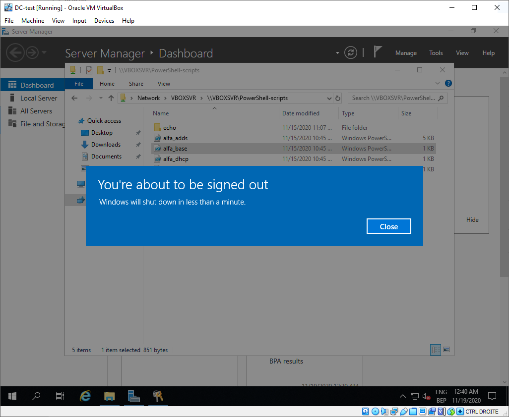
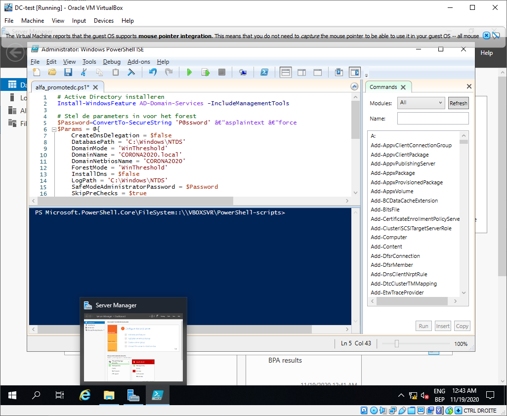
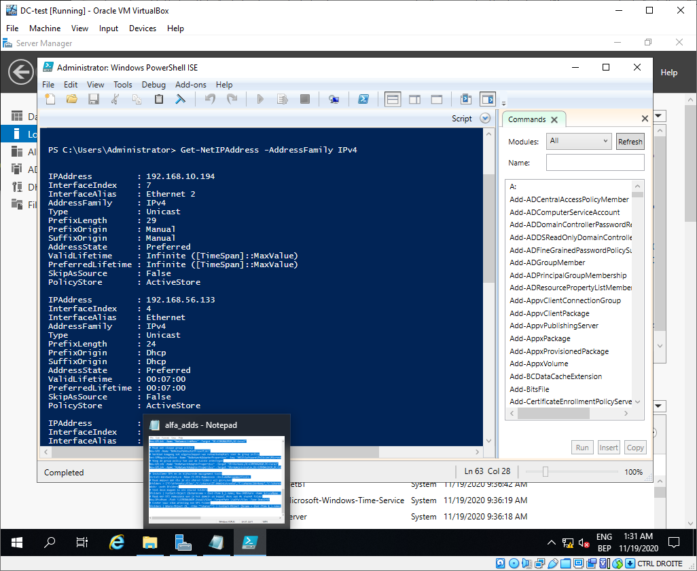
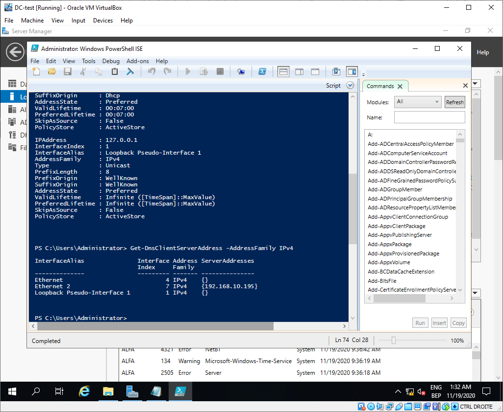
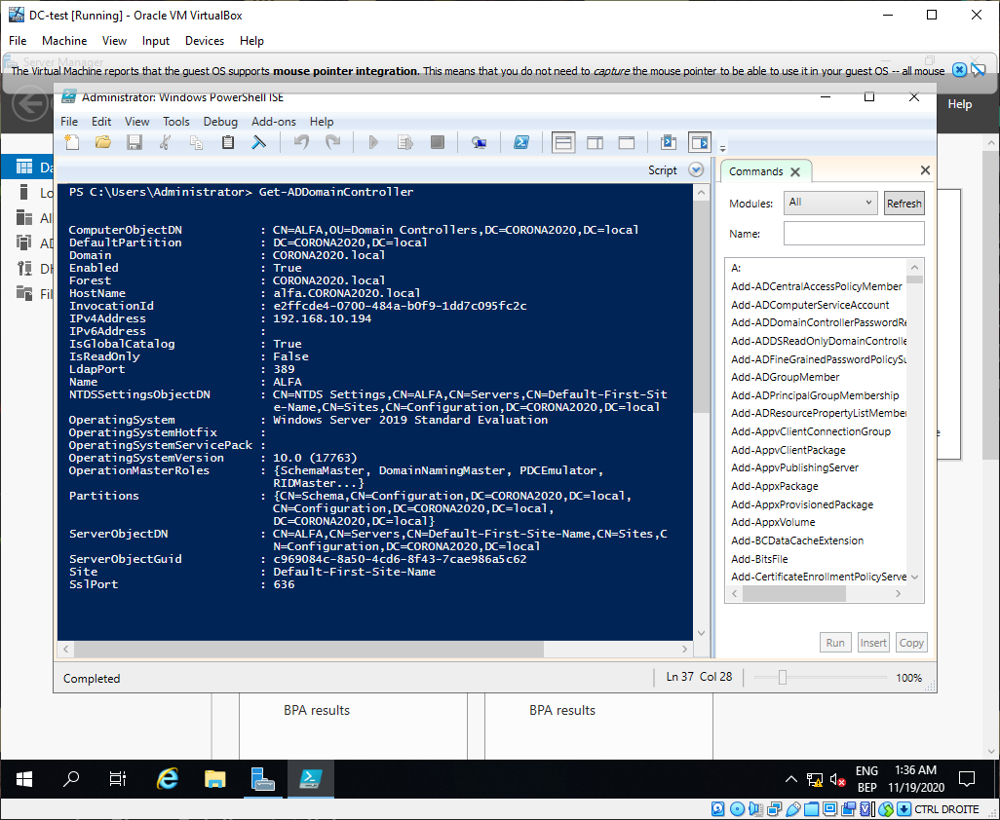
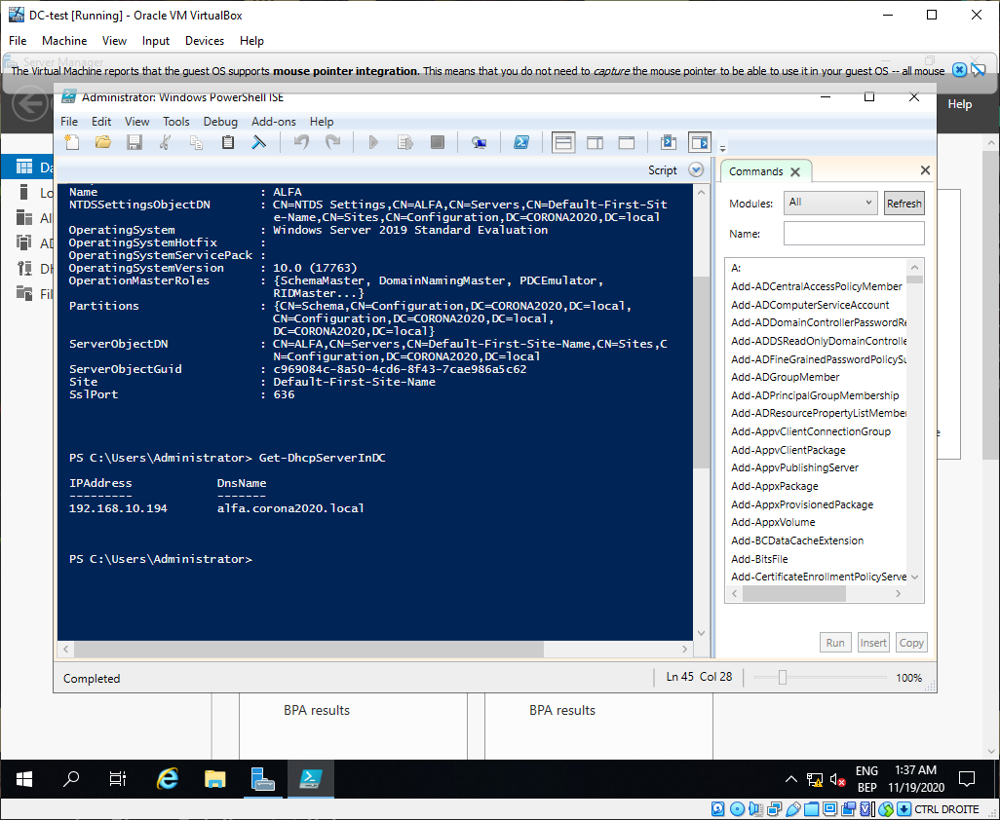
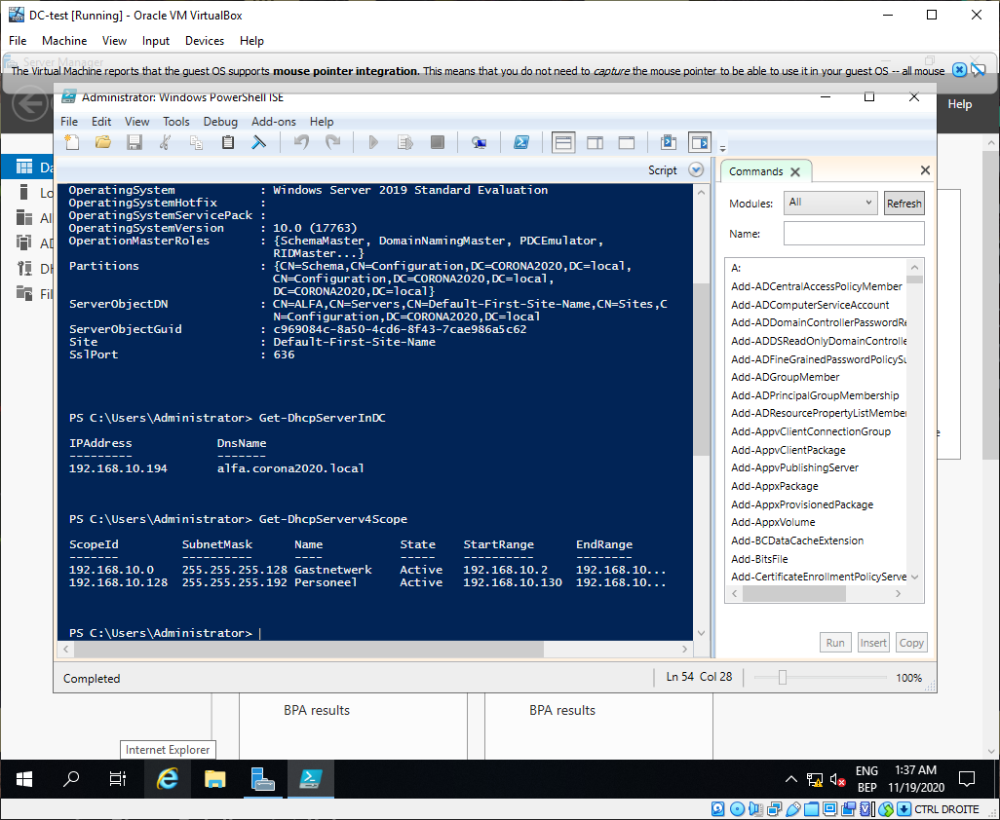
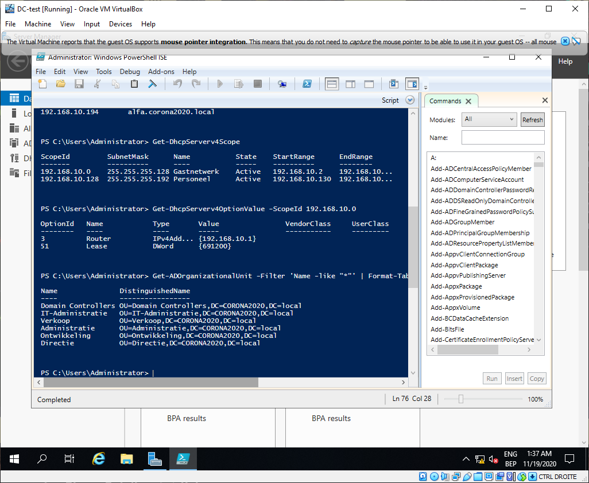

# Testrapport

* Verantwoordelijke uitvoering: Jari Van De Cappelle
* Verantwoordelijke testen: Kelvin Vermeulen

## Vooraf

Om de DomeinController op te stellen werd het stappenplan dat uitgeschreven werd volledig gevolgd.

## Uitvoering

Alle scripts werden uitgevoerd, zie screenshots:

## Resultaat

We hebben alle scripts uitgevoerd en de resulataten vergeleken met het verwachte resultaat, en dit komt volledig overeen zoals de onderstaande screenshots aantonen (DNS had fouten dus werd niet getest, zie Testrapport2-met-DNS.md):

