# Testrapport

* Verantwoordelijke uitvoering: Jari Van De Cappelle
* Verantwoordelijke testen: Kelvin Vermeulen


## Vooraf

Om de DomeinController op te stellen werd het stappenplan dat uitgeschreven werd volledig gevolgd.


## Uitvoering

### Installatie

- We voerden script 1 `alfa_base` uit met wachtwoord `Admin1`, de PC voerde het script uit en herstartte volledig uit zichzelf, alsook werd er correct terug ingelogd.
***Opmerking:*** Let erop dat de NAT-adapter `Ethernet` heet, en de `host-only`-adapter `Ethernet 2` heet. Indien dit niet zo is (checken in VirtualBox door kabel los te koppelen) kan je het in het script aanpassen, of de naam van de adapters omwisselen.


- We voerden script 2 `alfa_promotedc` uit, zoals beschreven in `Opzetten Domeincontroller.md`. Het herstarten duurde, doordat er een domein gejoind werd etc, wat langer (4GB RAM, 2 processors toegewezen). Ook nu herstartte de VM volledig autonoom, alsook het opnieuw inloggen gebeurde volledig automatisch.
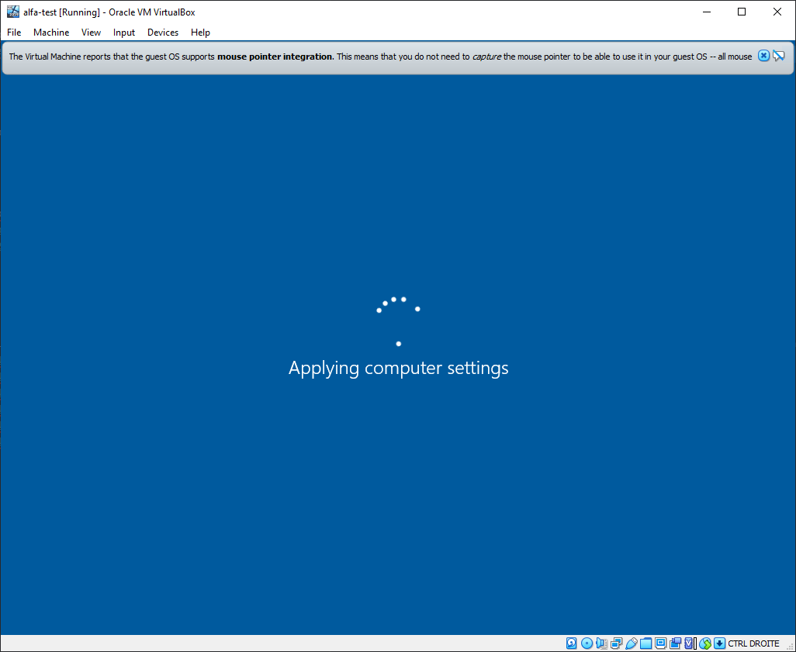
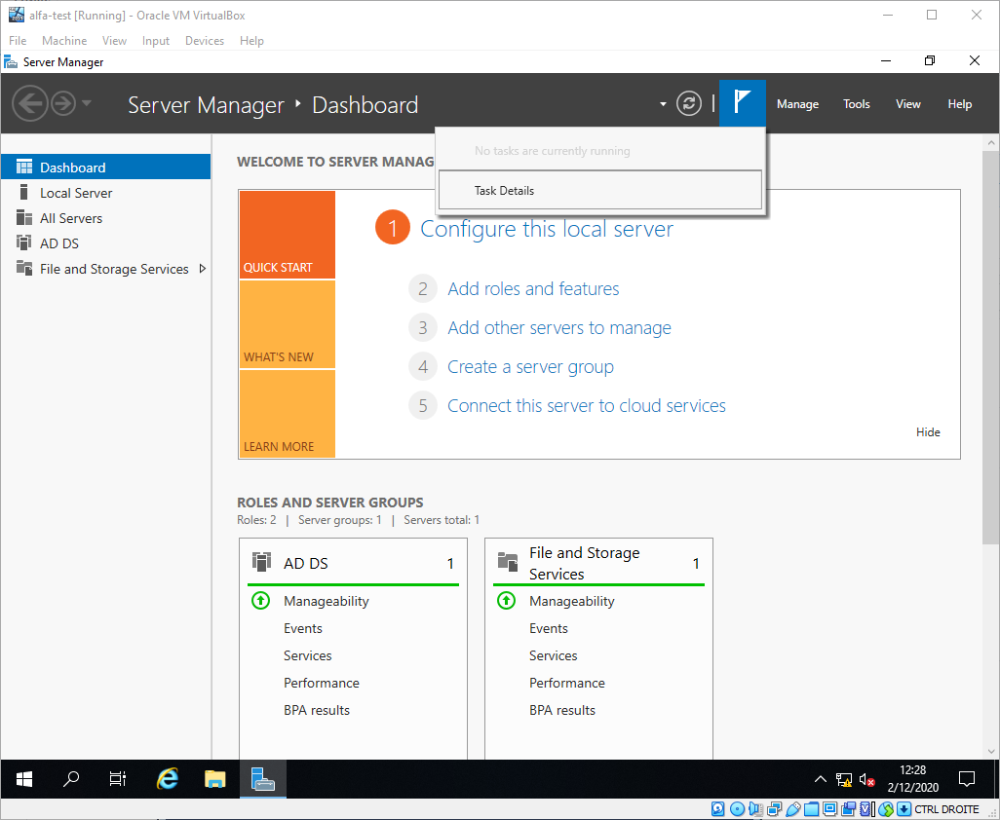

- We voerden script 3 `alfa_dhcp` uit. We zien dat er na het uitvoeren van script nog een interactie gevraagd werd in Server Manager. Hier moesten we gewoon op Next klikken en als laatste op commit. Ik ben er vrij zeker van dat als je deze stap overslaat, er geen problemen tevoorschijn komen aangezien er na het doorlopen van de DHCP-installatiewizard een melding kwam dat de DC reeds ingesteld was als DHCP server. Voor de zekerheid hebben we dit toch gedaan. Ook kwam er na het runnen van het script een error melding in PowerShell. Deze melding zei dat de scopes (gastnetwerk en personeel) niet aangemaakt konden worden. Wanneer we echter bij de DHCP-tools gaan kijken, zien we dat de scopes reeds aangemaakt waren. De foutmelding mogen we dus negeren (valt hoogstwaarschijnlijk te wijten aan het lezen van het script dat sneller is dan de effectie uitvoer van de commando's).

Starten van het script:
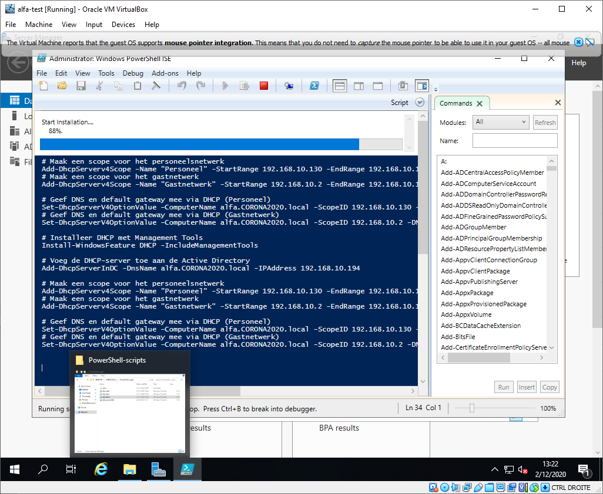

Interactie met configuration wizard:
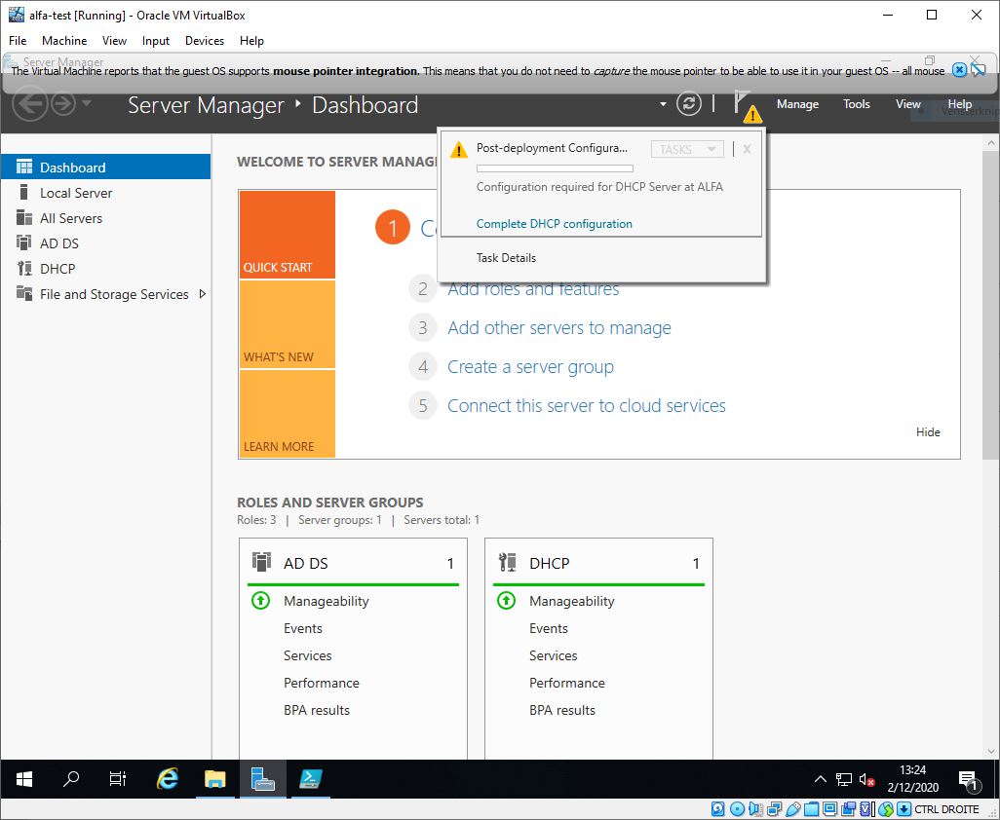
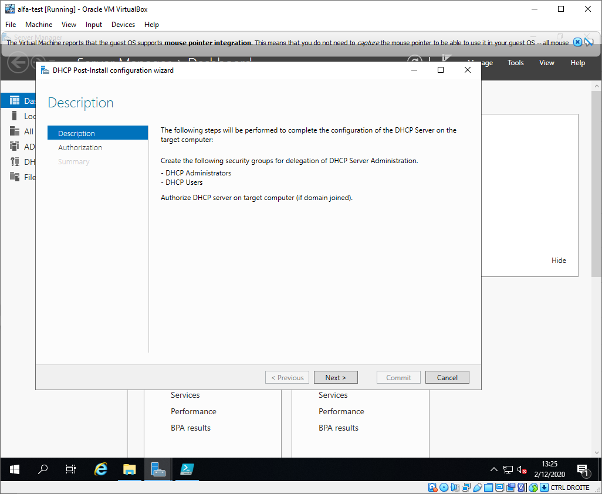

Te negeren foutmeldingen:
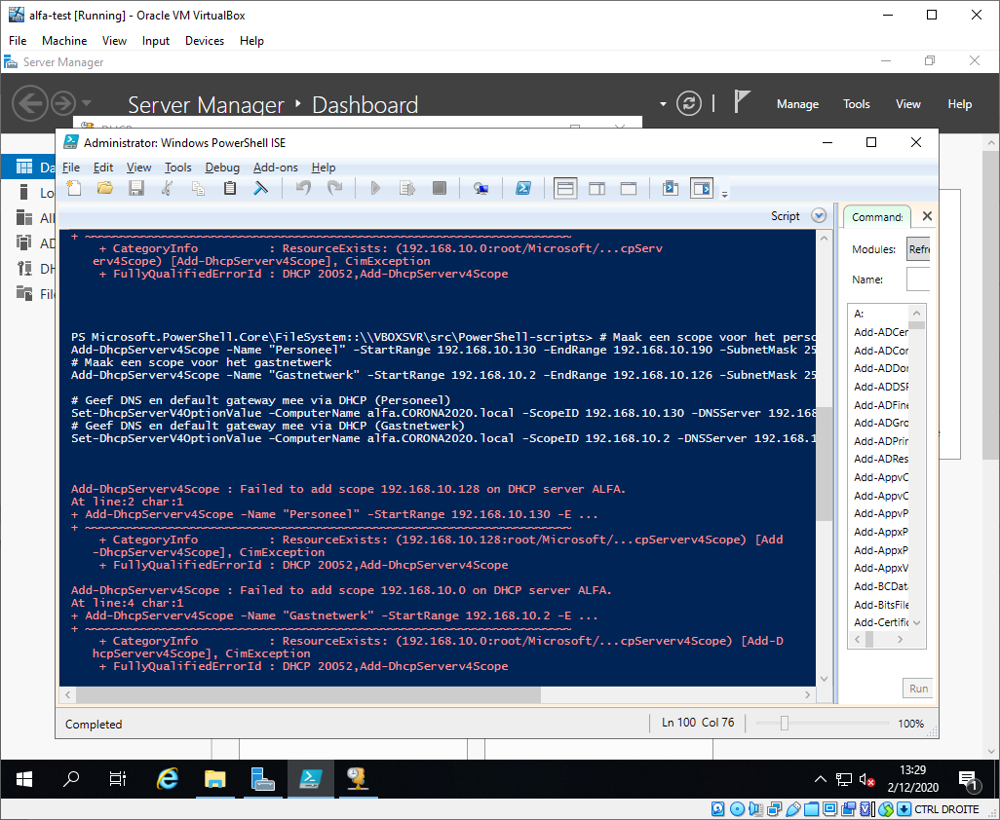

Controle dat DHCP scopes aangemaakt zijn:
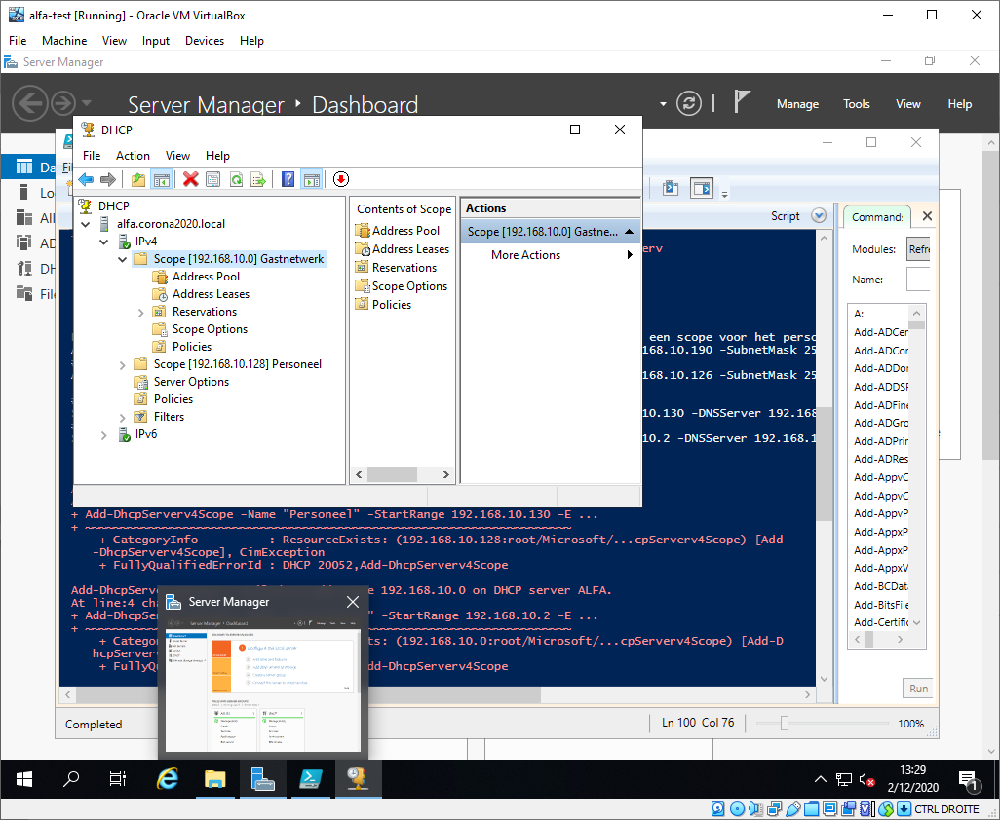

- We voerden ten slotte script 4 `alfa_adds` uit. Dit script duurde vrij lang aangezien er beleidsregels etc werden ingesteld en geconfigureerd. Het script eindigt zonder fouten.
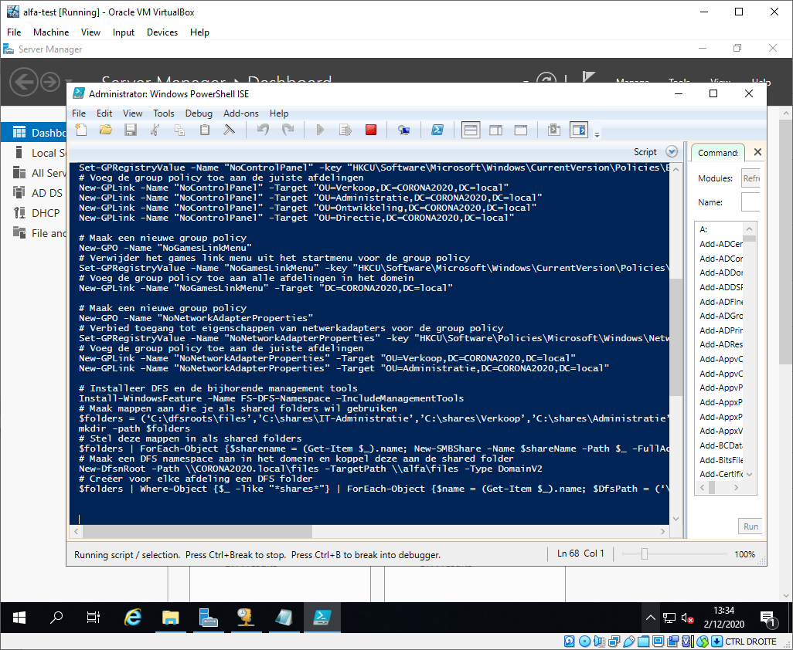
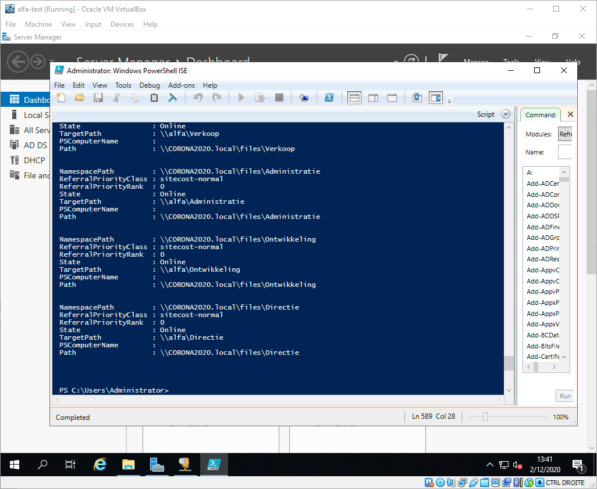


## Resultaat

We volgen de commando's zoals beschreven in het testplan. We tonen zowel de console uitvoer, als de resultaten aan de hand van screenshots.

### Stap 1: test de basisconfiguratie

- `$env:computername`

```console
PS C:\Users\Administrator> $env:computername
ALFA
```

- `Get-NetIPAddress -AddressFamily IPv4`

```console
PS C:\Users\Administrator> Get-NetIPAddress -AddressFamily IPv4


IPAddress         : 192.168.10.194
InterfaceIndex    : 2
InterfaceAlias    : Ethernet 2
AddressFamily     : IPv4
Type              : Unicast
PrefixLength      : 29
PrefixOrigin      : Manual
SuffixOrigin      : Manual
AddressState      : Preferred
ValidLifetime     : Infinite ([TimeSpan]::MaxValue)
PreferredLifetime : Infinite ([TimeSpan]::MaxValue)
SkipAsSource      : False
PolicyStore       : ActiveStore

IPAddress         : 10.0.2.15
InterfaceIndex    : 7
InterfaceAlias    : Ethernet
AddressFamily     : IPv4
Type              : Unicast
PrefixLength      : 24
PrefixOrigin      : Dhcp
SuffixOrigin      : Dhcp
AddressState      : Preferred
ValidLifetime     : 23:19:26
PreferredLifetime : 23:19:26
SkipAsSource      : False
PolicyStore       : ActiveStore

IPAddress         : 127.0.0.1
InterfaceIndex    : 1
InterfaceAlias    : Loopback Pseudo-Interface 1
AddressFamily     : IPv4
Type              : Unicast
PrefixLength      : 8
PrefixOrigin      : WellKnown
SuffixOrigin      : WellKnown
AddressState      : Preferred
ValidLifetime     : Infinite ([TimeSpan]::MaxValue)
PreferredLifetime : Infinite ([TimeSpan]::MaxValue)
SkipAsSource      : False
PolicyStore       : ActiveStore
```

- `Get-DnsClientServerAddress -AddressFamily IPv4`

```console
PS C:\Users\Administrator> Get-DnsClientServerAddress -AddressFamily IPv4

InterfaceAlias               Interface Address ServerAddresses                                        
                             Index     Family                                                         
--------------               --------- ------- ---------------                                        
Ethernet                             7 IPv4    {192.168.1.1}                                          
Ethernet 2                           2 IPv4    {192.168.10.195}                                       
Loopback Pseudo-Interface 1          1 IPv4    {}                                                     
```

### Stap 2: test de domeincontroller-configuratie

- `Get-ADDomainController`

```console
PS C:\Users\Administrator> Get-ADDomainController


ComputerObjectDN           : CN=ALFA,OU=Domain Controllers,DC=CORONA2020,DC=local
DefaultPartition           : DC=CORONA2020,DC=local
Domain                     : CORONA2020.local
Enabled                    : True
Forest                     : CORONA2020.local
HostName                   : alfa.CORONA2020.local
InvocationId               : ddcb3e57-cf56-47bf-96af-3af073b1388d
IPv4Address                : 192.168.10.194
IPv6Address                :
IsGlobalCatalog            : True
IsReadOnly                 : False
LdapPort                   : 389
Name                       : ALFA
NTDSSettingsObjectDN       : CN=NTDS Settings,CN=ALFA,CN=Servers,CN=Default-First-Site-Name,CN=Sites,C
                             N=Configuration,DC=CORONA2020,DC=local
OperatingSystem            : Windows Server 2019 Datacenter Evaluation
OperatingSystemHotfix      :
OperatingSystemServicePack :
OperatingSystemVersion     : 10.0 (17763)
OperationMasterRoles       : {SchemaMaster, DomainNamingMaster, PDCEmulator, RIDMaster...}
Partitions                 : {CN=Schema,CN=Configuration,DC=CORONA2020,DC=local, CN=Configuration,DC=C
                             ORONA2020,DC=local, DC=CORONA2020,DC=local}
ServerObjectDN             : CN=ALFA,CN=Servers,CN=Default-First-Site-Name,CN=Sites,CN=Configuration,D
                             C=CORONA2020,DC=local
ServerObjectGuid           : 8cc1f078-70c5-49ed-bd60-4b4b0adcfe45
Site                       : Default-First-Site-Name
SslPort                    : 636                                                  
```

### Stap 3: test de DHCP-configuratie

- `Get-DhcpServerInDC`

```console
PS C:\Users\Administrator> Get-DhcpServerInDC

IPAddress            DnsName                                                                         
---------            -------                                                                         
192.168.10.194       alfa.corona2020.local
```

- `Get-DhcpServerv4Scope`

```console
PS C:\Users\Administrator> Get-DhcpServerv4Scope

ScopeId         SubnetMask      Name           State    StartRange      EndRange        LeaseDuration
-------         ----------      ----           -----    ----------      --------        -------------
192.168.10.0    255.255.255.128 Gastnetwerk    Active   192.168.10.2    192.168.10.126  8.00:00:00    
192.168.10.128  255.255.255.192 Personeel      Active   192.168.10.130  192.168.10.190  8.00:00:00    
```


- `Get-DhcpServerv4OptionValue -ScopeId 192.168.10.0`

```console
PS C:\Users\Administrator> Get-DhcpServerv4OptionValue -ScopeId 192.168.10.0

OptionId   Name            Type       Value                VendorClass     UserClass       PolicyName
--------   ----            ----       -----                -----------     ---------       ----------
51         Lease           DWord      {691200}                                                        
3          Router          IPv4Add... {192.168.10.1}                                                  
6          DNS Servers     IPv4Add... {192.168.10.195}                                                

```

- `Get-DhcpServerv4OptionValue -ScopeId 192.168.10.128`

```console
PS C:\Users\Administrator> Get-DhcpServerv4OptionValue -ScopeId 192.168.10.128

OptionId   Name            Type       Value                VendorClass     UserClass       PolicyName
--------   ----            ----       -----                -----------     ---------       ----------
51         Lease           DWord      {691200}                                                        
3          Router          IPv4Add... {192.168.10.129}                                                
6          DNS Servers     IPv4Add... {192.168.10.195}                                                
```

### Stap 4: test de active directory users en computers

- `Get-ADOrganizationalUnit -Filter 'Name -like "*"' | Format-Table Name, DistinguishedName -A`


```console
PS C:\Users\Administrator> Get-ADOrganizationalUnit -Filter 'Name -like "*"' | Format-Table Name, DistinguishedName -A

Name               DistinguishedName                           
----               -----------------                           
Domain Controllers OU=Domain Controllers,DC=CORONA2020,DC=local
IT-Administratie   OU=IT-Administratie,DC=CORONA2020,DC=local  
Verkoop            OU=Verkoop,DC=CORONA2020,DC=local           
Administratie      OU=Administratie,DC=CORONA2020,DC=local     
Ontwikkeling       OU=Ontwikkeling,DC=CORONA2020,DC=local      
Directie           OU=Directie,DC=CORONA2020,DC=local          
```

- `Get-ADComputer -Filter 'Name -like "*"' | Format-Table Name, DistinguishedName -A`

```console
PS C:\Users\Administrator> Get-ADComputer -Filter 'Name -like "*"' | Format-Table Name, DistinguishedName -A

Name                DistinguishedName                                                
----                -----------------                                                
ALFA                CN=ALFA,OU=Domain Controllers,DC=CORONA2020,DC=local             
ITADMIN-werkstation CN=ITADMIN-werkstation,OU=IT-Administratie,DC=CORONA2020,DC=local
VERKOOP-werkstation CN=VERKOOP-werkstation,OU=Verkoop,DC=CORONA2020,DC=local         
ADMIN-werkstation   CN=ADMIN-werkstation,OU=Administratie,DC=CORONA2020,DC=local     
ONTWIK-werkstation  CN=ONTWIK-werkstation,OU=Ontwikkeling,DC=CORONA2020,DC=local     
DIREC-werkstation   CN=DIREC-werkstation,OU=Directie,DC=CORONA2020,DC=local
```

- `Get-ADUser -Filter 'Name -like "*"' | Format-Table Name, DistinguishedName, SamAccountName, UserPrincipalName -A`

```console
PS C:\Users\Administrator> Get-ADUser -Filter 'Name -like "*"' | Format-Table Name, DistinguishedName, SamAccountName, UserPrincipalName -A

Name             DistinguishedName                                              SamAccountName UserPri
                                                                                               ncipalN
                                                                                               ame    
----             -----------------                                              -------------- -------
Administrator    CN=Administrator,CN=Users,DC=CORONA2020,DC=local               Administrator         
Guest            CN=Guest,CN=Users,DC=CORONA2020,DC=local                       Guest                 
krbtgt           CN=krbtgt,CN=Users,DC=CORONA2020,DC=local                      krbtgt                
Test1 Gebruiker1 CN=Test1 Gebruiker1,OU=IT-Administratie,DC=CORONA2020,DC=local tgebruiker1    tgeb...
Test2 Gebruiker2 CN=Test2 Gebruiker2,OU=Verkoop,DC=CORONA2020,DC=local          tgebruiker2    tgeb...
Test3 Gebruiker3 CN=Test3 Gebruiker3,OU=Administratie,DC=CORONA2020,DC=local    tgebruiker3    tgeb...
Test4 Gebruiker4 CN=Test4 Gebruiker4,OU=Ontwikkeling,DC=CORONA2020,DC=local     tgebruiker4    tgeb...
Test5 Gebruiker5 CN=Test5 Gebruiker5,OU=Directie,DC=CORONA2020,DC=local         tgebruiker5    tgeb...
```
### Conclusie
We hebben alle scripts uitgevoerd en de resulataten vergeleken met het verwachte resultaat, en dit komt volledig overeen zoals de onderstaande screenshots aantonen (volgorde van de scripts):
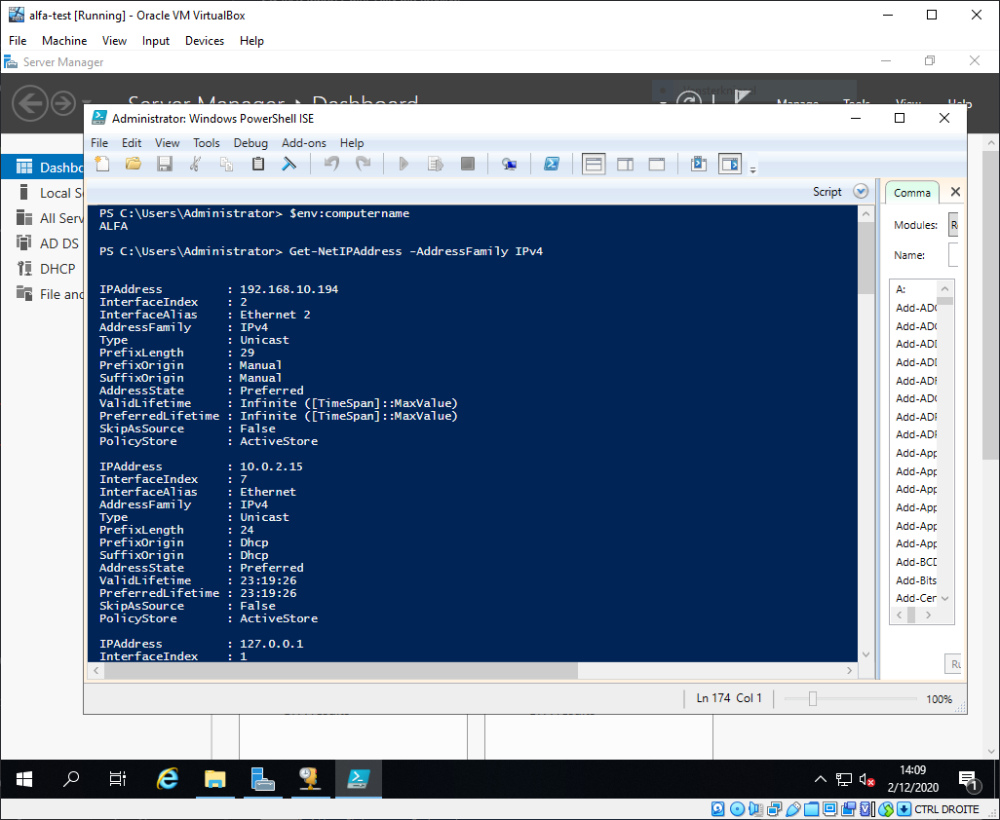
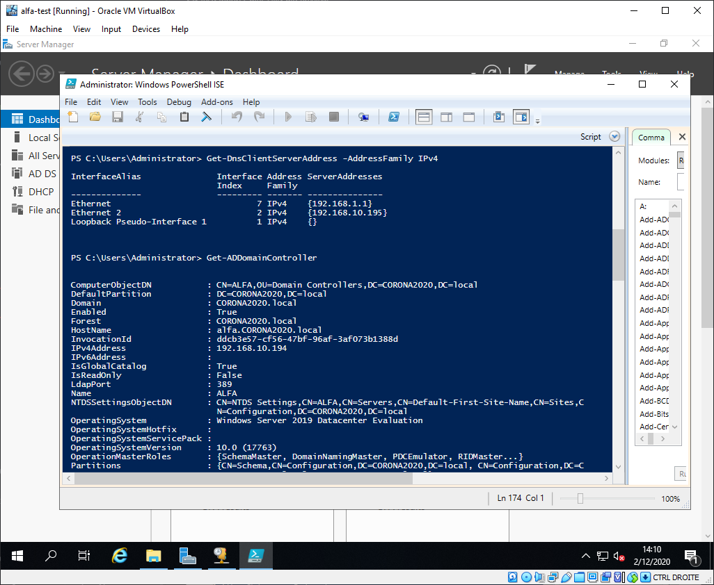
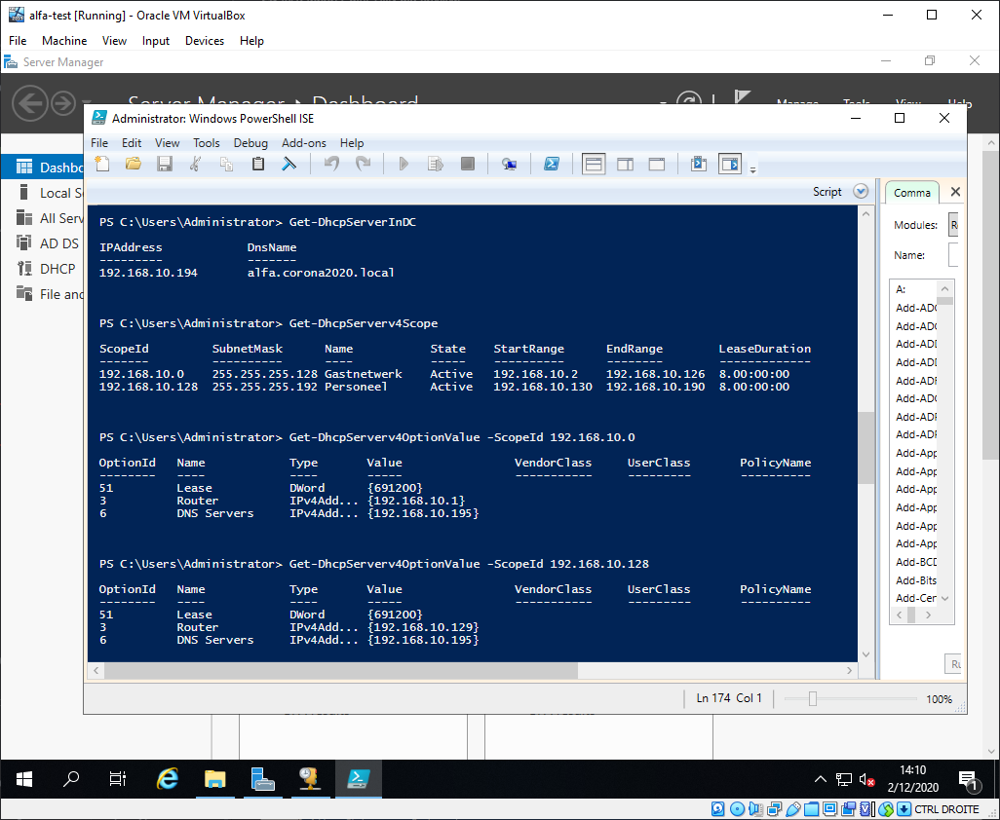
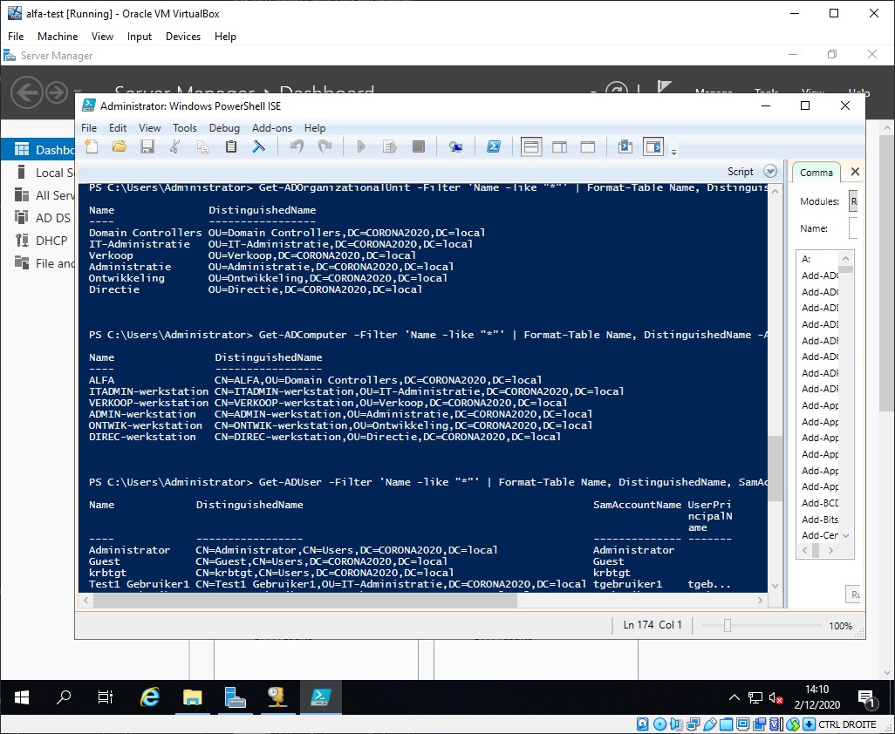
