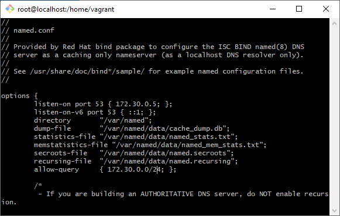
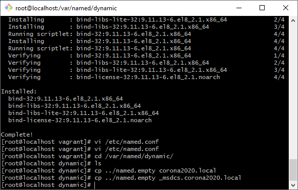
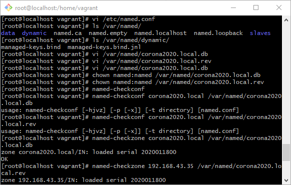

# Overzicht documentatie

## Inhoud documentatie

- Lastenboek per component/deelopdracht
    - Specificaties en requirements
    - Wat zijn de deeltaken? Dit worden tickets in Trello
    - Wie is verantwoordelijk voor realisatie en testen?
    - Hoe lang schat je voor elke deeltaak nodig te hebben?
- Technische documentatie
    - Achtergrondinfo, neerslag opzoekingswerk
    - Procedurebeschrijvingen
    - Functionele testplannen en -rapporten
    - Integratietestplannen en -rapporten

## Handmatige installatie SCCM
- [Deploy WinServer19](https://www.prajwaldesai.com/deploy-windows-server-2019-using-sccm/)
- [YouTube install SCCM 2019 1u+](https://www.youtube.com/watch?v=qqR5twQqHHg)
- [YouTube step-by-step](https://www.youtube.com/watch?v=amrg_mlFvuk)
- [What is SCCM](https://www.youtube.com/watch?v=3Mr3Fka8Gb8)

## Documentatie mbt scripts/PowerShell & SCCM
- [Microsoft](https://docs.microsoft.com/en-us/mem/configmgr/apps/deploy-use/create-deploy-scripts)
- [run script step-by-step](https://www.anoopcnair.com/sccm-run-script-step-by-step-guide/)
- [SCCM deploy PowerShell script](https://systemcenterdudes.com/sccm-deploy-powershell-script/)

## PXE Boot documentatie
- [WikiPedia](https://en.wikipedia.org/wiki/Preboot_Execution_Environment)
- [HowToGeek what is network booting and how to use it?](https://www.howtogeek.com/57601/what-is-network-booting-pxe-and-how-can-you-use-it/)

## MDT documentatie
- [Prepare for deployment with MDT (Microsoft)](https://docs.microsoft.com/en-us/windows/deployment/deploy-windows-mdt/prepare-for-windows-deployment-with-mdt)
- [Get started with MDT](https://docs.microsoft.com/en-us/windows/deployment/deploy-windows-mdt/get-started-with-the-microsoft-deployment-toolkit)
- [Deploy Win10 image MDT](https://docs.microsoft.com/en-us/windows/deployment/deploy-windows-mdt/deploy-a-windows-10-image-using-mdt)
- [MDT Wiki](https://en.wikipedia.org/wiki/Microsoft_Deployment_Toolkit)

## Deploy Linux with SCCM
- [Microsoft: deploy Linux](https://docs.microsoft.com/en-us/mem/configmgr/core/clients/deploy/deploy-clients-to-unix-and-linux-servers)
- [Puppet](https://puppet.com/blog/no-more-sccm-support-for-your-linux-and-unix-servers-puppet-can-help/)

### Handmatige installatie van DNS server en DC
Om zelf al wat vooruit te kunnen met de deelopdracht voor SCCM leek het mij handig om zelf eens een DNS server met Linux en een DC met Windows Server op te zetten.
Dit was toch moeilijker dan verwacht. Ik volgde een tutorial die de DNS server in het 192.168.43.x netwerk opstelde (zie bronnen onderaan). Er werd gebruik gemaakt van BIND.
De DC configureerde ik handmatig, er werd enkel AD DS geïnstalleerd. Tot nu toe lijkt dit te werken, al stuitte ik onderweg wel op enkele problemen (foute syntax bij sommige .conf files op DNS server,
 foute forwarding, het fout instellen van het domein...). Onderstaande bronnen werden gebruikt voor troubleshooting.

#### Screens

### Troubleshooting

- [DNS 14:00 - 25:00](https://www.youtube.com/watch?v=0X9em99Vcl0)
- [DNS health checken op DC in cmd](https://www.youtube.com/watch?v=NLNvXe-TF8Q)
- [standalone DNS server opstellen](https://social.technet.microsoft.com/Forums/en-US/2bdcdc45-14c2-493f-afda-7f92e808714a/forum-faq-setting-up-a-standalone-dns-server-for-active-directory-service?forum=winserverDS)
- [Windows AD met external DNS](https://serverfault.com/questions/727121/windows-ad-with-external-dns)
- [setup BIND authoritative DNS](https://www.linuxbabe.com/ubuntu/set-up-authoritative-dns-server-ubuntu-18-04-bind9)

### Enkele links die me verder hielpen bij het installeren en configureren
- [Linuxtech](https://www.linuxtechi.com/setup-bind-server-centos-8-rhel-8/)
- [Microsoft](https://docs.microsoft.com/en-us/previous-versions//dd316373(v=technet.10))
- [Serverfault](https://serverfault.com/questions/509116/can-i-completely-remove-the-windows-dns-in-favour-of-bind9-in-an-ad-network)
- [firewall.cx](http://www.firewall.cx/linux-knowledgebase-tutorials/system-and-network-services/830-linux-bind-domain-zone-file.html)
- [reddit](https://www.reddit.com/r/homelab/comments/3zqg2y/using_bind_linux_as_a_backup_dns_server_to_a/)
- [serverlab](https://www.serverlab.ca/tutorials/linux/network-services/using-linux-bind-dns-servers-for-active-directory-domains/)

### Azure Research
- [SCCM on Azure](https://www.youtube.com/watch?v=IsaNyEo_nMk)
- [Azure tutorial for beginners](https://www.guru99.com/microsoft-azure-tutorial.html)
