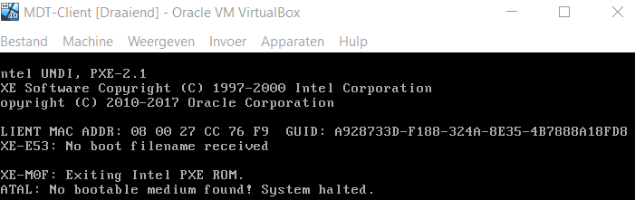

1. Script1: 

- lijn 20: verander prefixlength in 29
- lijn 26: verander domeinnaam in CORONA2020.local
- probleem bij joinen domein; ligt waarschijnlijk aan dns

2. Create system management container.ps1:

- werkt correct

3. Delegate permission.ps1:

- lijn 24: verander $ConfigMgrSrv in echo
- werkt correct

4. roles_features.ps1:

- werkt correct

5. Install SQL Server 2017.ps1:

- werkt correct

6. Setup ADK and WDS.ps1:

- misschien internet explorer security aanpassen zodat downloaden van google drive makkelijker gaat
- werkt correct

7. wsus_role_install.ps1:

- handleiding wat onduidelijk met de *GEEN *
- werkt correct

8. prereqs_sccm.ps1:

- lijn 20: om de prerequisites op te slaan in C:\SC_Configmgr_SCEP_1606\SCCM_Prerequisites moet je hier $SCCMPath gebruiken ipv $SourcePath (ofwel is dit fout aangegeven in de handleiding)
- werkt correct

9. Extend the schema in AD.ps1:

- misschien yes/no eruit halen voor volledige automatisering
- werkt correct

10. sccm_install.ps1:

- melding 'could not connect or execute sql query', script eindigt wel zonder fouten aan te geven

11. geen script

12. WIN10.7z:

- kan het bestand niet uitpakken zonder 7zip software (misschien installatie automatiseren in een eerder script)

13. WDS_config.ps1:

- Error: "The deployment server role service for windows deployment services has not been configured on the server", ligt waarschijnlijk aan fouten bij punt 10 -> proberen sccm handmatig te installeren 
- fout bij het handmatig installeren sccm:


## Testen WDS & PXE Booten
1. WIN10.7z downloaden en uitpakken in C:

- gelukt

2. WDS rol handmatig installeren en herstarten

- gelukt 

3. WDS configureren met script WDS_config.ps1

- gelukt

4. DHCP aanpassen op de DC

- opties 066 en 067 aanpassen
- gelukt

5. NAT NIC uitschakelen op SCCM server

- gelukt
- Host-only adapter van alfa, bravo en echo veranderen in bridged adapter

6. Nieuwe VM aanmaken met de naam MDT-Client

- "network" aanvinken en bovenaan Boot Order plaatsen
- MDT-Client opstarten  

- Fout bij toekennen ip adres via DHCP
- Intussen opgelost op alfa (scope verkeerd ingesteld)  

- Ip adres werd toegekend via DHCP door alfa
- Nieuwe fout: ```TFTP open timeout```

